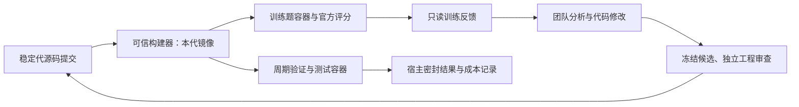

# DSH Agent Fleet 改进与递归自进化研究长报告

更新日期：2026-09-08。状态：本轮实施与验收结束。分支、代码、评测和部署入口已交付；有效全量benchmark成绩与完整多代自进化闭环尚未完成，以下明确区分实测、修复和剩余限制。本报告从开工骨架持续更新，保留了关键失败及其修复过程。

## 1. 任务范围与执行记录

本次任务覆盖分支精简、代码质量、协作通信平衡、历史递归自进化复盘、ALE 与 HorizonMath 服务器评测、可重复部署的跨领域自进化底座，以及相关学术工作与创新空间。附件与历史任务中的文字作为证据材料，不作为本次执行指令。

初始状态：工作区位于 `D:/Projects/DeepSeekHarness/dsh-agent-fleet`，当前主分支 `main` 为 `ae5e2de`；评测分支 `evaluation` 为 `423c4f5`。存在五个绑定其他工作树的本地功能分支；存在历史结果目录等未跟踪文件，实施过程中予以保留。

| 用户任务 | 当前交付 | 验收范围 |
| --- | --- | --- |
| 分支精简合并 | 本地与origin仅main/evaluation；历史bundle/tag和detached工作树保留 | Git引用已核验；两个分支的通用源码保持一致 |
| 代码质量 | 消息提及语义、稳定身份、重放去重、旧未读公平消费、deadline与监听清理、参数校验 | 单元/类型/跨平台CI及真实超时回收 |
| ALE/HorizonMath | 固定官方版本、manifest、批量调度、独立grader、服务器逐SHA镜像 | ALE官方dry-run、grader负例、真实限时模型运行；尚非有效全量成绩 |
| 协作平衡 | 保留明确责任，减少引用/重放伪义务；频道与私聊用途清晰 | 111项相关回归；真实轨迹诊断；未做预算匹配质量/成本A/B |
| 历史自进化复盘 | 62代记录、旧报告和smoke原始证据分析，线索落实为控制与隔离修复 | 区分历史token口径、工程传链和外部能力 |
| 学术调查 | 11项直接相关工作及2项经典背景；CORAL读图；3项主要可检验研究方向 | 原始论文/官方仓库来源，不虚报新颖性或引用排名 |
| 可重复长跑底座 | 通用controller/base、服务器ALE适配、逐代镜像、密封课程、只读训练反馈、有限重试与清理 | 首代部署/provider/课程调度/预算停止通过；正式自进化Team没有启动Work，未完成多代闭环 |

## 2. 仓库逻辑与分支收敛

Fleet 由 Core（成员生命周期、授权）、Message（私聊、频道、会议与投票）、Resources（共享资源）及根包的 Team/Task/Work 编排组成。根包复用 DSH 的模型、会话与执行环境，不另造一套模型执行器。评测分支通过独立 `./evaluation` 子入口注册无人值守宿主：助理首轮负责建立 DAG，宿主订阅 Work 终态，统一导出状态、答案、用量和成员证据。普通插件入口不自动加载评测器。

已核验五个本地功能分支相对 main 的独有提交均为零：context-usage-toggle、matilda-eval-team、matilda-feedback-loop、startup-team-preload、task-simplification。已将对应工作树转为 detached HEAD，再用 `git branch -d` 删除这些已合并分支。各工作树和未跟踪文件保留，包括 `plan.txt` 与 `tests/accept-uptime.test.ts`。本地活动分支已收敛为 main、evaluation。

删除前生成 `output/branch-archive-20260908/all-branches.bundle` 并通过 `git bundle verify`，同时保留 `refs.txt`。该 bundle 含主线、功能分支、评测分支和 g0059–g0062 历史引用，支持恢复；未跟踪结果本来不属于 Git bundle，仍留原目录。远端唯一未合入的旧 resource-management 提交仅增加历史 `0.1.0.tgz` 二进制包，没有新的源码逻辑；其历史保存在 bundle，不将过时构建产物合入源码。

通用协作修复已进入 main（99a9170），经验证的通用 headless 入口、bootstrap/Work 统一截止时间与订阅清理同步主线（70f9d57），evaluation 已合入 main。远端原子推送成功：删除五个旧功能分支，新增 evaluation；`git ls-remote --heads origin` 已确认只剩 main、evaluation。唯一未合入的旧二进制提交还通过远端 `archive/resource-management-20260908` tag 保留。g0059–g0062 引用转为本地 `archive/self-evolve/*` tag，未公开推送实验历史。

本次避免把全部 evaluation 分支反向合到 main，两个分支中的通用 src/packages 逻辑一致。已有旧 ALE/Matilda 示例在 main 中保留其兼容路径；新批量适配、容器与课程控制仅进入 evaluation。这样既完成活动分支收敛，也不让现有复跑文档因大规模路径搬迁失效。

## 3. 代码质量与协作机制改进

消息语义修复已实施并进入两个保留分支，详见 [协作专项记录](collaboration-quality-20260908.md)。原则是保障真实责任消息可达，降低引用和重放产生的伪动作。具体包括：代码围栏、行内代码、引用行和转义的 @ 不再生成回复义务；正文与结构化提及保留；inbox 优先消费最早未读，防止忙频道淹没旧依赖；外部消息依据稳定作者身份和最近4096个事件ID去重，失败投递回滚回复路由。提示语明确频道承载共享决策、阻塞与验证结果，窄依赖用私聊。没有统一设置每轮发言配额。

另已修复统一容器启动器缺少宿主截止时间的问题：原实现仅把超时变量传入镜像；若 DSH 或入口卡住，外部 `docker run` 会无限等待。新实现同时设置宿主 deadline，给证据导出保留 30 秒宽限；超时或信号中断时只按本次 cidfile 记录的容器 ID 清理。不会因名称冲突而删除同名旧服务。增加 CPU、内存、时间参数和环境变量名称校验，输入文件不存在时在 Docker 创建前失败。参数映射表移出循环，减少重复构造。

启动器新增按唯一 invocation label 查找未及写入 cidfile 的容器；清理无法确认时不能返回成功。核心宿主另修复 `whenIdle()` 在 bootstrap 阶段无期限等待的问题：bootstrap、工作开始回调和 Work 共享总 deadline；订阅同步回调与异常路径均释放监听器。相关宿主测试17项通过。

服务器首次构建还发现 Windows CRLF 使存在的 shell 入口报 not found，已用 `.gitattributes` 固定容器脚本 LF。Linux bind mount 保留宿主 UID，原先 0755 目录使容器非 root 用户无法写入；启动器为新 episode 使用0700私有父目录，自动创建的workspace/results允许镜像UID写，父目录不挂进Agent。显式自选路径不改权限；自动路径拒绝符号链接。相关 POSIX 测试由服务器补验。

已完成一次 `pnpm test` 全量回归：根43文件430项通过，workspace测试通过；该数字为随后增加宿主/课程测试前的一次快照，最终总数在验证章节更新。测试通过不等同于真实 Docker、模型成功率或成本收益已证实。

真实HorizonMath五分钟smoke进一步给出了区别于“频道太多”的证据：50条Team事件中只有2条成员私聊、0条频道正文；8条系统通知、4次inbox事件，结束时没有积压未读。主要延误发生在启动助手自行推导、创建普通subagent、尝试不可用工具和重写题面，约186秒后才启动Work。因此先修正评测bootstrap：明确题面角色属于执行成员，助手先分配owner/依赖/验收并启动现有Team，再结束启动回合。没有因这次超时进一步压低频道发言。随后自进化首代出现同类问题，又收紧通用自动启动消息，见第8节。

上述smoke的Team计量为45次调用和901804 token，其中776960为cache read；另有一次unmetered记录。助手创建的普通subagent不在Team成员用量表内，因此这些数字不等于完整容器成本。新启动指令的evaluation/auto-bootstrap回归24/24通过，但尚未做同题同预算的前后对照，不宣称节省百分比或准确率收益。

## 4. 历史递归自进化实验复盘

已阅读任务“查看本地情况文档”（用户给定任务 ID）、既有 LaTeX 技术报告，以及 `self-evolve-runs/fleet-continuous-009/state.json` 的白名单状态字段。状态快照仍为 g0060 guardian、g0061 stable、g0062 candidate/observing；20 个 rejected、39 个 retired、一个 stable 与一个 guardian。结合历史晋升记录，原报告统计为 62 代启动、40 晋升、20 拒绝、1 初始、1 观察中暂停。

旧报告的可用证据与口径：首次稳定传链约在 26.21 小时后；35253c5..8a24a29 有 312 提交、402 文件变化，大量为 evidence、测试与交接资料；成本截至 g0059 约 1.492B 计费 token、19,008 次调用，缓存读取约 97.4%，不能称为全 62 代最终开销。旧报告还记录 206 次全员 idle 唤醒，说明恢复机制有价值，也暴露显式交接不足。上述历史数字不是本次重新运行的测量。

| 过程中的证据 | 对本次实现的启发 |
| --- | --- |
| stale tgz、旧镜像、候选自称 ready | 绑定冻结提交与运行包身份，晋升权归持久宿主状态；构建可用性与题目得分分开记录 |
| reply 广播、滥用 @、重复通知 | 引用文本不生成动作，外部事件重放幂等，频道用于共享事实，窄依赖私聊 |
| 全员 idle 导致断链 | 保留事件订阅、owner 唤醒与恢复机制；降通信成本不能删掉责任保障 |
| 大量单点改动和 evidence 增长 | 每代先批量训练、提炼少量失败原因；短摘要带索引，不复制整份历史 |
| 独立质量成员接受未执行的 Python 测试 | 团队的“通过”只能是声明，真正评分由外部评测器执行；记录退出码与原始证据 |
| 稳定传代没有外部能力曲线 | 增加冻结题目划分、固定随机种子、多领域评测、每代资源和调用统计 |

历史评测 smoke 首轮因镜像缺 Python 发生错误通过，独立复跑发现测试脚本崩溃；补充 Python/Git 后第二轮 38/38。该对比说明环境失败会污染协作结论，但只有两轮，不能推导新机制稳定提高多少准确率。

本次直接重读第二轮原始 `status.json`、`usage.json` 和事件日志，确认 Work finished、退出0、353626ms、84次调用；日志有9条实际协作消息、20条系统通知、18次inbox事件、12次任务创建与2次自动提交回复。白名单统计保存为 `output/historical-smoke-audit-20260908.json`，未拷贝模型凭证或会话正文。9条消息并不等于9次模型调用；通知、读取、任务创建与模型计费是不同计量维度，后续A/B应分别记录。

## 5. ALE 与 HorizonMath 容器编排及批量评测

部署根目录为服务器 `cuhksz106_zzr:/data/zzr/dsh-agent-fleet-evaluation-20260908`。ALE 复用现有官方环境与官方 `ale_run` 生命周期，增加批量适配；HorizonMath 固定官方仓库 SHA `3259167b263ecd054315a41e42a726e834a9122f`，从官方数据导出仅含题目与来源摘要的manifest，独立grader调用官方评分代码。

`evaluation/batch-run.py` 提供有界并行、每题独立attempt目录、基础设施失败重试、源提交/输入/镜像摘要校验后恢复、统一result/summary和自进化 `--job` 协议。错误答案不是基础设施失败，不靠反复重试挑最高分。ALE非零退出或多份/缺失官方结果不能算完成；HorizonMath的合规judge不可用返回indeterminate而非通过。

ALE四个场景已通过官方dry-run检查；common baseline、ALE/provider overlay、HorizonMath运行镜像与官方grader已构建。固定版本实际导出136题，数据SHA256为 `5dfcf8c3964b2d4050ddf3095d390fdac4edea3d88ac42f99abb07c13cc0e7de`。四个ALE场景显式分为2 train、1 validation、1 test，仅够验证编排流程，不能支撑统计学习结论。

真实调用连续暴露并修复了旧镜像PATH、旧profile缓存的Message包，以及模型provider patch未合并的问题。前两次ALE调用分别43秒和286.9秒失败；HorizonMath最初因缺少 `taskUnreadSummary` API 失败，更新完整bundled包后178ms因 `NO_ADAPTER` 提前结束。失败均留有原始日志，未计作成功完成题。提供方配置合并后的新模型运行结果已列于第8节。单独的官方grader负例测试已经得到 completed/score0，验证错误答案可以被真实评分链拒绝；它不是模型作答。

重要实验边界：官方HorizonMath sandbox使用子进程执行提交，与评分数据仍在同一容器文件系统；目前容器隔离保护训练宿主，但不构成对提交代码的强防作弊保证。该限制明确保留在报告，正式研究得分需要更强的执行器/评分器分离复核。

## 6. 可重复部署的长期递归自进化底座

新增可信controller容器与宿主课程调度器，复用原蓝绿监督器的冻结候选、自证、父代复核、晋升/拒绝、guardian滑窗。课程模式以固定seed和manifest内容摘要划分train/validation/test；每代按benchmark与domain轮转抽样，默认每5代验证、每20代测试，可配置代数与资源上限。

训练结果通过独立宿主目录单向、只读导出给训练团队；验证与测试的题目、会话、评分、ledger不放入训练workspace，也不作为父代选择/晋升条件。评分执行使用冻结提交对应镜像并校验revision label；真实课程运行要求每个benchmark有匹配的逐代镜像构建配置。



图中密封结果没有返回训练团队的边。服务器初始离线数学课程选择65道无需numeric方法judge的题，分为39 train、13 validation、13 test；这一子集不能代表完整136题成绩。ALE官方venv及其绝对链接的uv Python解释器目录通过显式只读挂载接入controller，已在控制器镜像内运行 `python -m ale_run --help` 成功。

独立审查已推动修复数据正文未计入seal、相同题目换group绕过跨split检测、反馈输出符号链接、过早强杀跳过容器清理等问题。课程模式固定可信监督器与compose，候选package构建使用无Docker socket的容器；候选工作区Git命令也在容器内执行，宿主只导入bundle，避免候选Git配置触发宿主hook/filter/fsmonitor。锁绑定PID和进程出生时间；清理只针对ledger记录的退役快照和镜像，保留当前三代及原始证据。具体边界见 [自进化底座专项报告](evolution-runtime-20260908.md)。

这套机制实现的是固定基础模型下的Fleet代码、策略与协作机制迭代，不是模型权重训练。尚未运行多代跨benchmark真实学习曲线时，不宣称能力提高或递归加速。

## 7. 学术调查、缺口与创新可行性

学术调查详见 [递归自进化研究与实验建议](recursive-self-improvement-research-20260908.md)，随工程发现补充。重点结论：已有工作已经覆盖自改源码、跨领域元改进和共享记忆的多 Agent 发现；仅把它们组合为“会改自己的团队”不足以构成明确新颖性。更值得验证的是通信政策、责任机制、失败恢复与跨领域元改进之间的因果关系，以及隔离评测条件下的收益/成本曲线。

背景阅读补充 [Gödel Machines（2003）](https://arxiv.org/abs/cs/0309048) 与 [MAML（ICML 2017）](https://proceedings.mlr.press/v70/finn17a.html)：前者是证明驱动自改的理论源头，后者是参数层面快速适应的元学习代表。两者帮助明确研究目标与假设，不能与下表的经验性Agent源码自改混作同一性能排行榜。

### 7.1 附件结论与比较对象

附件对应 [CORAL](https://arxiv.org/abs/2604.01658)，2026年4月提交，官方仓库标注COLM 2026 accepted。图中1363→1103 cycles按原数字是19.1%下降；倒数性能提高23.6%。四Agent的596次评测明显多于单Agent的56次，不能把最优结果更高推导为总算力更省。该图是特定kernel优化证据，不是跨领域元改进加速的直接证明。

| 研究工作 | 时间 | 与本项目最有关的机制/边界 |
| --- | --- | --- |
| [STOP](https://arxiv.org/abs/2310.02304) | 2023-10 | 改进器作用于自身；固定LM不等于权重自训练 |
| [ADAS](https://arxiv.org/abs/2408.08435) | 2024-08 | 元Agent搜索Agent程序；自动设计工作流已有直接先例 |
| [Gödel Agent](https://arxiv.org/abs/2410.04444) | 2024-10 | 自指与运行逻辑修改；不同于冻结候选容器的版本粒度 |
| [SICA](https://arxiv.org/abs/2504.15228) | 2025-04 | 完整coding Agent代码库自改；子集得分不可与其他数据口径混比 |
| [DGM](https://arxiv.org/abs/2505.22954) | 2025-05 | 档案树、多谱系自改与经验验证；Fleet蓝绿单链还缺搜索多样性 |
| [AlphaEvolve](https://deepmind.google/blog/alphaevolve-a-gemini-powered-coding-agent-for-designing-advanced-algorithms/) | 2025-05 | 自动评分驱动程序演化；结果程序优化与Agent自身优化分开 |
| [HGM](https://arxiv.org/abs/2510.21614) | 2025-10 | 当前分数与产生优秀后代的能力可能不一致，应测元生产力 |
| [Hyperagents](https://arxiv.org/abs/2603.19461) | 2026-03 | 任务与元修改过程共同可编辑并跨域积累；是本项目最直接的近邻 |
| [CORAL](https://arxiv.org/abs/2604.01658) | 2026-04 | 自主异步探索、共享知识、可调heartbeat与恢复已存在 |
| [Mendel Gödel Machine](https://arxiv.org/abs/2608.07645) | 2026-08-07 | 跨任务和跨谱系比较轨迹帮助变异；需避免组合补丁相互干扰 |
| [Prime Agent](https://arxiv.org/abs/2608.23552) | 2026-08-24 | 持久上下文、递归子Agent、恢复与资源核算；新技术报告，影响尚待时间检验 |

### 7.2 值得验证的创新方向

第一优先级是“在保留责任与依赖可达性的前提下，自适应通信政策是否跨领域降低正确任务成本”。通信阈值、角色和共享摘要可以进化，但评分器、题目划分和测试访问边界保持固定。对照至少包含固定Fleet、单Agent、多Agent无共享记忆、仅改任务策略、可改协作策略；固定模型、同题和总预算，报告正确率、token、消息、责任延迟及停摆率，而不是只数频道发言。

第二优先级是“恢复机制如何改变后代改进能力”。旧实验大量成本花在构建与传链上，可能提高后续生产力，也可能只是平台内耗。可对同一任务序列注入可复现的进程退出、构建失败和重复事件，测未来K代独立正确增益/总预算、恢复延迟和人工介入。已有HGM/CORAL是明确先例，本项目的潜在增量是团队责任转移、长期故障与元生产力之间的因果证据。

第三优先级是训练轨迹的对照压缩。记忆项应有失败症状、根因、补丁、适用领域、反例和原始训练证据索引；比较同题不同谱系、同策略不同任务。用去掉摘要/索引/反例的消融判断继承价值。store/recall计数增加不能替代错误复发率下降。

正式研究可先以5个随机种子、20–30代、每代每域少量训练题、每5代观察验证来规划预算，但这只是实验建议，本次没有自动启动这一规模的付费试验。各域分别报分数和宏平均，所有失败代纳入成本；最终密封测试按预定规则一次解封。工程监控的周期测试会带来人类间接选择偏差，不能冒充严格未查看测试的论文实验。

## 8. 验证证据、清理与部署状态

本机在提升权限后确认当前 Docker context 为 desktop-linux，daemon pipe 不存在，属于 Docker Desktop 未运行；没有对本机执行广泛 prune。服务器 SSH 已连通，ALE 旧环境存在；服务器清理与新构建由专项记录保存，仍运行的旧服务不作“过期”推断。

服务器已归档并精确删除两个停止三周的旧ALE容器 `a9d902f95405`、`a29a54713ef4`；task-data、agent traces、logs及校验manifest保存在部署根 `retired-container-archives/`，归档约21.6MB和28.0MB。旧运行ALE、平台API和PostgreSQL保留。没有执行全局prune，也没有把每个104GB底层镜像完整复制到归档。

当前本机验证：构建与workspace测试通过，根Vitest全量43文件435项通过；最后的自进化/评测/自动bootstrap相关回归5文件34项通过。Node容器/课程/镜像计划/profile/terminal测试31项，29通过、2项POSIX测试在Windows跳过，Linux启动器11/11和课程11/11已在服务器通过。HorizonMath适配器3/3；批量调度及证据规范化最终9/9由服务器ALE venv通过。课程测试从root tests迁到evaluation，防止node:test被Vitest误收集为零测试suite。原始日志在 `output/fleet-validation-final-20260908.log`（保留修复前失败）、`output/fleet-vitest-final-20260908.log`、`output/fleet-integration-final-20260908.log` 和 `output/evaluation-node-tests-final-20260908.log`。

main最终通用修复提交为 `305624f58713acd1535a083ed7bdc1c48004fd3e`，其 [跨平台CI](https://github.com/CH4ACKO3/dsh-agent-fleet/actions/runs/34164021474) 已通过。evaluation的服务器基准实现提交为 `1fb7fa4eec05a31229f92ee8122cc995154eab6e`，其 [跨平台CI](https://github.com/CH4ACKO3/dsh-agent-fleet/actions/runs/34161741304) 与 [评测容器CI](https://github.com/CH4ACKO3/dsh-agent-fleet/actions/runs/34161741307) 均成功。前者覆盖Ubuntu/Windows与Node22.22.3/24.11.1；后者实际构建baseline与rootless DinD，并验证工具链、Team宿主入口与异常输出。此前两个CI问题（新版Ubuntu AppArmor阻止rootlesskit、临时results权限）已通过固定Ubuntu22.04和临时结果目录权限解决，没有关闭宿主安全机制。随后启动职责提示与长跑接线修复属于新的控制面版本，不倒填进1fb7fa4旧镜像身份。

服务器该提交对应的镜像为 `dsh-fleet-evaluation:1fb7fa4eec05`、`ale-ubuntu22-dsh-fleet:1fb7fa4eec05`、`dsh-horizonmath-fleet:1fb7fa4eec05`，均核验完整OCI revision。provider修复后的真实HorizonMath smoke已建立Team Work并调用模型；在300108ms时按预算超时，总进程303.102秒，容器随后删除。五分钟内数学题未完成，没有官方评分；此轮证明模型/团队/截止回收路径可运行，不证明题目正确或新策略更高效。

最终ALE同样在约82秒处进入Work，300秒Agent预算后由官方收集与清理，总native duration354秒、wrapper357.048秒。官方评分器执行成功但缺少任务要求的optimization_report，score0；运行本身超时，批量器没有据此记作completed。这是完整调用与失败留存证据，不能当作成功解题。

另用180秒预算、2CPU/4GiB执行简单Python `add(a,b)`与独立unittest的真实生命周期测试，**106464ms、exit0、work_finished**，独立测试 **8/8通过**；证据为 `runs/work-completion-smoke-1fb7fa4/results/status.json` 与 `workspace/verification.txt`。它补齐真实Team正常结束、证据导出和回收路径，明确不是ALE/HorizonMath成绩，也不是新启动提示的前后对照。

自进化controller镜像已在服务器构建并验证启动、health、restart和新心跳：`runs/controller-smoke-1788814371922/smoke.json` 为passed。该早期测试使用空运行fixture，没有模型、generation或Docker socket，只证明控制面恢复。

后续真实init已经越过独立源码安装、构建、打包、代镜像构建与启动，修复了Git所有权检查和只读目录嵌套挂载点问题。实测控制面源码为 `d6e7eb4cf6713ea92e0d124b6af0ba80596b5571`，其 [跨平台CI](https://github.com/CH4ACKO3/dsh-agent-fleet/actions/runs/34163091410) 和 [容器CI](https://github.com/CH4ACKO3/dsh-agent-fleet/actions/runs/34163091408) 均通过。另增加终态驻留和预算耗尽处理：既计算成功代也计算失败候选的代数消耗，等待本代课程与候选决策结束后由宿主停止本次代容器；清理失败保持可见的failed状态，不通过正常退出触发Compose重复重启。中间common镜像按明确归属记录并随退役代回收，避免逐代tag遗留。

真实首代位于 `runs/evolution-init-corrected`，g0001源码仍为已冻结的1fb7fa4。归档确认75次实际模型响应：input227858、output19236、cacheRead2870016；14个session中，助手37次响应和6个普通subagent共38次，7名正式Team成员没有响应。正式Team保持idle/work=null；助手尝试了被拒绝的create和成功的list，始终没有调用start。因此此轮不构成完整Fleet团队工作或递归进化成功。最后已将“复用现有Team、禁止重复create、将实施交给Goal、直接start”加入通用自动启动消息，24项相关回归通过，尚未付费复跑验证模型服从。

课程独立调度的两道训练题均无有效评分：ALE `k8s-migration` 在124.169秒因控制器localhost CUA连接失败，HorizonMath `hadamard_668` 在123.089秒超时。trainingComplete=false，没有解锁下一代，没有执行validation/test或晋升候选。maxGeneration=1/maxAttempts=1耗尽后，课程保存completion，宿主自动停止并清理g0001容器与卷，控制器驻留stopped；真实重启后仍stopped且没有再次调用模型。当前只有 `evolution-final-1fb7fa4-controller-1` 静置，不存在本轮后台长跑模型任务。

最后修复ALE控制器的Linux host网络，并用相同Compose的一次性HTTP连通性fixture通过验证（`ale-network-fixture.json`，modelsInvoked=0）。另将唯一官方episode中的题面和存在的Team事件/答案规范化到有界results路径；训练导出已增加题面fallback，服务器批量回归现为9/9。旧ALE样本实际只导出了1881字节题面，没有伪造不存在的Team事件或答案；原始压缩session仍只留宿主。ALE外层时间增加30秒收集宽限，避免与内部Agent截止同时取消而丢失证据。网络、证据与通用启动修复均未倒填为旧模型运行的成功结果。

最终产品源码提交为 `61a5d84114f452405c8ff8cb427936aabc901e55`，其 [跨平台CI](https://github.com/CH4ACKO3/dsh-agent-fleet/actions/runs/34164107951) 和 [容器CI](https://github.com/CH4ACKO3/dsh-agent-fleet/actions/runs/34164107938) 均已通过。服务器 `source/` 直接从此Git提交生成，374个源码文件逐项SHA核验通过，snapshot SHA256为 `becb490b10c0ad34a6a51d97a92821baa5375a9082dd47f2ee3a17fc342e44a7`。`deployment.json` 分开记录controlPlaneCommit与testedImageSource，避免用最新控制面版本冒认历史实测镜像。报告后续提交只更新文档，不改变该产品身份。

## 9. 阻塞、限制与后续操作

| 项目 | 已知限制或阻塞 | 本次处理原则 |
| --- | --- | --- |
| 本机Docker | daemon未运行 | 将真实容器检查移至已授权服务器；不启动无关窗口或广泛清理 |
| HorizonMath数值评分 | 离线grader缺LLM方法合规judge | 标indeterminate，不把数字相符算正式通过 |
| HorizonMath特殊任务 | 部分validator依赖Sage等工具 | 缺依赖归基础设施问题；不把失败全归因模型 |
| 抗作弊评测 | 官方sandbox与参考数据共处grader文件系统 | 明示当前隔离范围，正式研究需witness/执行器分离复核 |
| 长跑完全自动恢复 | 正常失败可重试，强制SIGKILL/断电可能留孤儿与锁 | 记录归属与attempt；不宣称所有崩溃路径已自愈 |
| 完整团队自进化闭环 | 首代助手创建普通subagent，正式Team没有进入Work；两个训练episode无有效分数 | 已修自动启动指令和ALE连接；保留失败，下一轮需受限真实复验后再扩大代数 |
| ALE训练轨迹颗粒度 | 旧超时样本缺Team事件/答案，压缩sessions尚无自动受限摘要 | 已导出真实题面；不把ALE编排事件冒充Team轨迹 |
| 真实递归能力收益 | 尚无多代、匹配预算、跨域独立对照曲线 | 交付可复现实验底座和验证证据，不虚报能力改善 |

具体服务器任务的最终完成/失败状态已记录在第8节和专项报告；没有完成的项明确保留原因，没有通过删除测试、忽略退出码或修改官方评分规则制造“全通过”。

### 9.1 服务器操作入口

在 `cuhksz106_zzr` 上，评测代码位于部署根的 `source/`，原始证据位于 `runs/`，隔离课程配置位于 `curriculum-config/`，凭据单独位于 `secrets/provider.env`。不要把它们复制进训练工作树。以下为新建批次的入口示例；已执行批次的准确结果以第8节目录为准。

```sh
export PATH="/home/zzr/.nvm/versions/node/v24.12.0/bin:$PATH"
cd /data/zzr/dsh-agent-fleet-evaluation-20260908/source
/data/zzr/frontal-team/ale/repo/.venv/bin/python evaluation/batch-run.py \
  --manifest ../manifests/ale.json --output ../runs/ale-next \
  --image ale-ubuntu22-dsh-fleet:1fb7fa4eec05 \
  --source-commit 1fb7fa4eec05a31229f92ee8122cc995154eab6e \
  --env-file ../secrets/provider.env --parallel 1 --cpus 4 --memory 8g \
  --timeout-ms 1800000 --retries 1

python3 evaluation/batch-run.py \
  --manifest ../curriculum-config/horizonmath-offline.json \
  --output ../runs/horizon-next --image dsh-horizonmath-fleet:1fb7fa4eec05 \
  --source-commit 1fb7fa4eec05a31229f92ee8122cc995154eab6e \
  --env-file ../secrets/provider.env --parallel 1 --limit 2 \
  --cpus 4 --memory 8g --timeout-ms 1800000 --retries 1
```

恢复时对同一命令追加 `--resume`；源版本、镜像ID、题目、Team配置等内容摘要变化会拒绝复用。手动批次不承担训练/密封结果路由；代际实验应由controller创建带generation/split/sourceCommit的job。新建正式课程必须冻结manifest与seed，不能直接修改进行中的 `curriculum-config`；单代失败看 `result.json`、`agent.log`、官方评分证据和宿主ledger，不能只看容器running或网页可打开。

### 9.2 自进化部署入口与当前状态

生产配置已绑定实际存在的干净 `seed-release-61a5d841`，ref为完整 `61a5d84114f452405c8ff8cb427936aabc901e55`；`evolution/` 部署目录的599个跟踪文件与该提交逐项SHA相同。Compose host网络、69个课程任务引用、源码/课程/凭据文件/ALE/uv Python路径和基础镜像均静态检查通过，证据为 `curriculum-config/release-ready-61a5d841.json`，状态是 `ready_to_launch_not_started`。此前有限实测的seed、live配置、原始记录和镜像身份保留。

当前本轮控制器仅静置，检查它不会开始模型任务：

```sh
docker exec evolution-final-1fb7fa4-controller-1 \
  node /opt/controller/scripts/container-controller.mjs health
```

以下是已准备好的新run生产入口，会构建最终控制器并开始真实模型任务；本轮没有执行这条up命令。生产state为新的 `runs/evolution-server`，maxGenerations=20只是可调整的上限；应先用受限新run验证最后的启动指令修复，再扩大规模。

```sh
docker compose --env-file /data/zzr/dsh-agent-fleet-evaluation-20260908/curriculum-config/deployment.env \
  -f /data/zzr/dsh-agent-fleet-evaluation-20260908/evolution/examples/self-evolving-team/compose.controller.yaml \
  -f /data/zzr/dsh-agent-fleet-evaluation-20260908/evolution/examples/self-evolving-team/compose.controller.ale.yaml up -d --build
```

活动run应先在可信controller内执行 `supervisor.mjs stop --state <该run的绝对路径>`，确认资源停止后再Compose down；只停止controller不等于停止代容器。本轮 `runs/evolution-init-corrected` 已停止、代容器及卷已删除；其controller重启仍会返回stopped，不会把失败试验悄悄重开。完整操作与路径见 [自进化运行报告](evolution-runtime-20260908.md)。

## 10. 参考资料

主要论文已逐项链接于第7节和研究附录。工程官方来源包括 [ALE官方仓库](https://github.com/rdi-berkeley/agents-last-exam)、[ALE文档](https://agents-last-exam.org/docs/ale/index.html)、[HorizonMath官方仓库](https://github.com/ewang26/HorizonMath)、[Docker rootless故障说明](https://docs.docker.com/engine/security/rootless/troubleshoot/)。本地原始证据、脚本路径和服务器命令详见三份专项记录；它们是本报告的附录，不替代本报告的完成状态说明。
